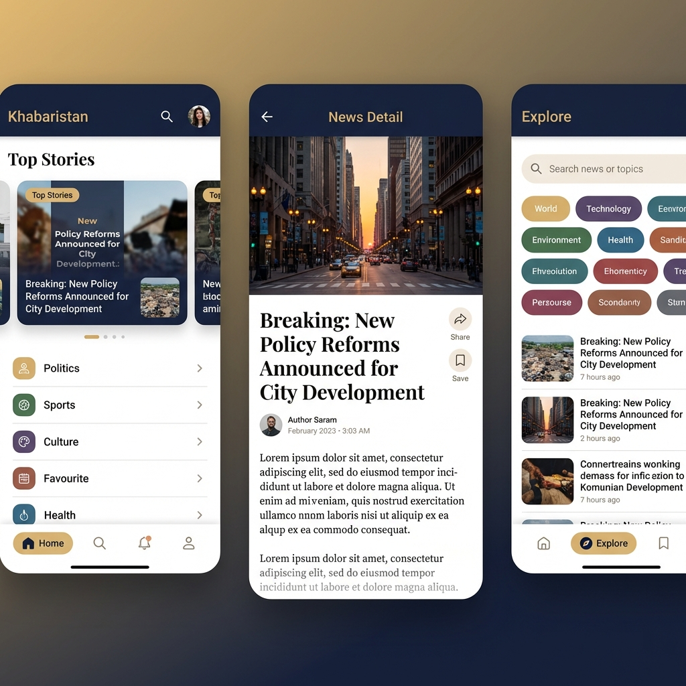

# 📰 KhabarIsTan - Elevating Your News Experience

<p align="center">
  
</p>

<p align="center">
  
  
  
  
</p>

## 📝 Overview

**KhabarIsTan** is an ultra-premium, high-fidelity news ecosystem designed for the modern reader. Built with a "Luxury First" philosophy, it combines professional journalism tools with a sophisticated **Royal Blue & Gold** aesthetic. From AI-powered voice reporting to local-first privacy architecture, KhabarIsTan redefines how you consume and contribute to global narratives.

---\
\


## ✨ Premium Features (v2.1.0 Update)

- 👑 **Royal UI Transformation**: A complete overhaul featuring glassmorphism, sophisticated gradients, and professional Outfit typography.
- 🔒 **Privacy & Mission Modules**: Added high-fidelity, dedicated screens for Privacy Policy and "About KhabarIsTan" to ensure transparency.
- 🔐 **Secure Auth Experience**: Fully redesigned professional Authentication suite including Login, Signup, and Secure Logout with confirmation.
- 🌓 **Adaptive Theming**: Real-time Light/Dark mode switching that respects system preferences and enhances readability.
- 🎧 **AI News Reporting**: Integrated local Text-to-Speech (TTS) for a hands-free news consumption experience.
- 👤 **Luxury Profile Management**: Redesigned user account system with premium card-based layouts and dual-tone avatars.

---

## 📸 Immersive Interface

<p align="center">
  
</p>

---

## 🕒 Version Log

### [Version 1.0.0] - Foundation
- **Core News Feed**: Initial implementation of news categories and browsing.
- **News Detail View**: Simple article reading and image support.
- **Social Sharing**: Basic platform-native news distribution.
- **Search & Filter**: Essential functionality to find relevant news.

### [Version 2.1.0] - The Luxury Update (Current)
- **UI/UX Revolution**: Implemented the Royal Blue & Gold design system.
- **Auth 2.0**: Added secure login/signup and premium profile management.
- **Privacy Core**: Introduced dedicated Privacy Policy and About modules.
- **Theme Engine**: Dynamic switching between Light and Dark modes.
- **AI Integration**: Added text-to-speech engine for immersive listening.
- **Performance**: Optimized scrolling with bouncing physics and sliver layouts.

---

## 🏗️ Architectural Excellence

The project follows a **Modular Clean Architecture**, ensuring high maintainability and rapid scalability:

- **Core Engine**: Handles networking (`http`) and data parsing.
- **Privacy Layer**: Localized persistence using `shared_preferences`.
- **UI System**: Custom-built design tokens for the Royal Blue & Gold theme.
- **Service Layer**: Discrete handlers for **TTS**, **Sharing**, and **Web Navigation**.

---

## 🛠️ Modern Tech Stack

- **UI Framework**: Flutter (v3.x / Material 3)
- **Language**: Dart (High-Performance)
- **Image Intelligence**: `cached_network_image` for fluid visual loading.
- **Voice Synthesis**: `flutter_tts` for professional AI reporting.
- **Animation Engine**: `flutter_staggered_animations` for cinematic entrance effects.
- **Social Integration**: `share_plus` for high-impact news distribution.
- **Interactivity**: `url_launcher` & `webview_flutter` for deep-dive reading.

---

## 🚀 Installation & Deployment

### Prerequisites
- Flutter SDK (Stable Channel)
- Dart SDK
- Android Studio / Xcode / VS Code

### Quick Start
1. **Clone the repository**
   ```bash
   git clone https://github.com/YourUsername/khabaristan.git
   cd khabaristan
   ```
2. **Install Premium Dependencies**
   ```bash
   flutter pub get
   ```
3. **Launch the Experience**
   ```bash
   flutter run
   ```

---

## 🔥 Strategic Roadmap

- [x] **v2.1.0**: Complete UI Transformation & Auth Suite implementation.
- [ ] **v2.2.0**: Firebase Cloud Sync & Real-time Database integration.
- [ ] **v2.3.0**: AI News Categorization using NLP.
- [ ] **v2.4.0**: Video News Integration & Immersive Reels.

---

## 🤝 Collaboration & Support

Contributions are what make the open-source community such an amazing place to learn, inspire, and create. 

1. Fork the Project
2. Create your Feature Branch (`git checkout -b feature/LuxuryEnhancement`)
3. Commit your Changes (`git commit -m 'Add some LuxuryEnhancement'`)
4. Push to the Branch (`git push origin feature/LuxuryEnhancement`)
5. Open a Pull Request

---

## 📜 License

Distributed under the MIT License. See `LICENSE` for more information.

---

<p align="center">
  Crafted with Excellence by <b>Khuzaim Sajjad</b><br>
  <i>Powered by KhabarIsTan Media Group</i>
</p>
