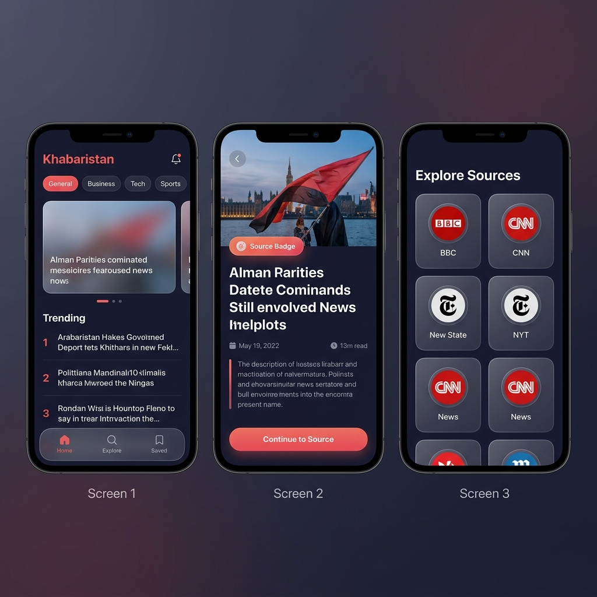
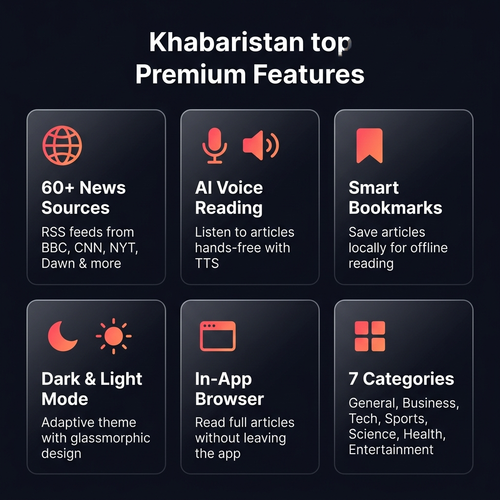
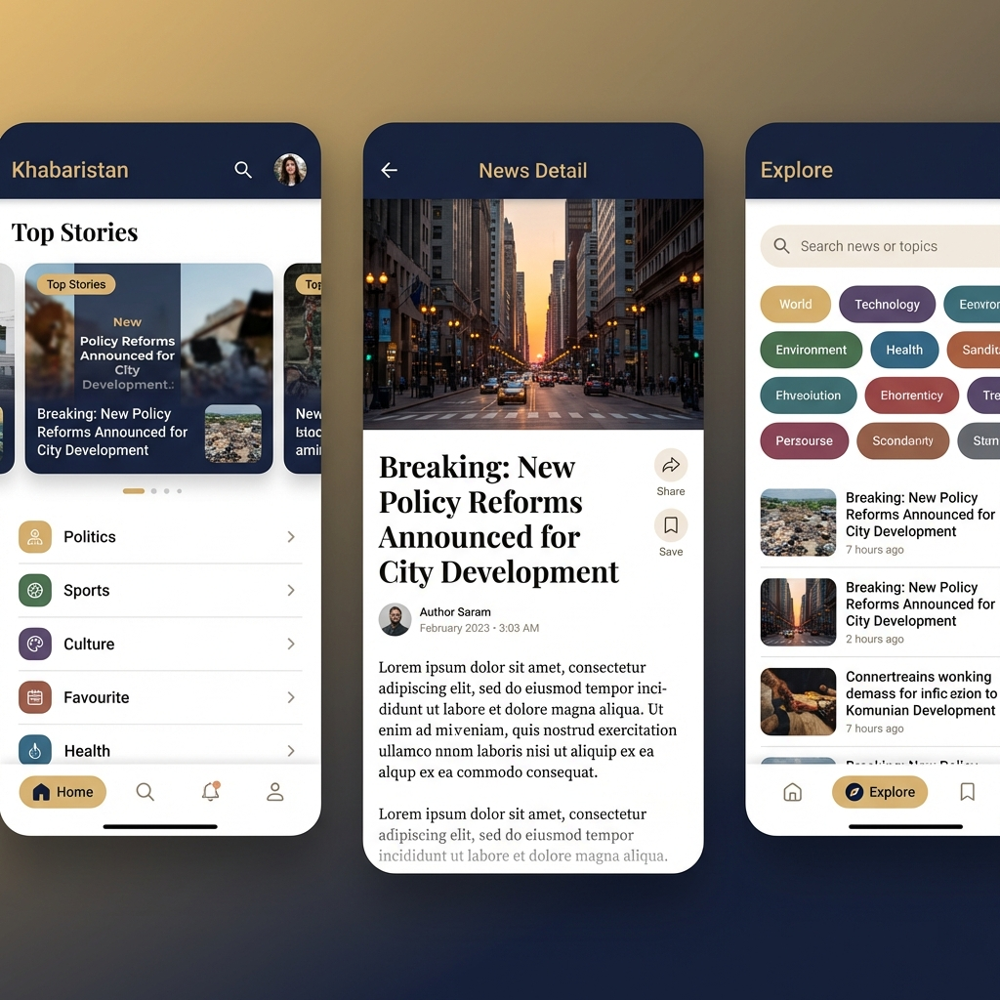

# KhabarIsTan — Premium Flutter News Application

<p align="center">
  
</p>

<p align="center">
  
  
  
  
  
  
</p>

<p align="center">
  <b>Elevating Your News Experience</b><br>
  <i>A high-fidelity, glassmorphic news reader built with Flutter — powered by 60+ global RSS feeds</i>
</p>

---

## 📸 App Showcase

<p align="center">
  
</p>

---

## ✨ Premium Features

<p align="center">
  
</p>

| Feature | Description |
|---------|-------------|
| 💎 **Glassmorphic UI** | Frosted glass containers, smooth blur effects (`BackdropFilter`), elegant gradients, and modern typography via Google Fonts (Outfit & Inter) |
| 🌍 **60+ News Sources** | Aggregates RSS feeds directly from publishers — BBC, CNN, NYT, Al Jazeera, Dawn, The Guardian, Reuters, TechCrunch, ESPN, and 50+ more |
| 🎙️ **AI Voice Reporting** | Integrated Text-to-Speech (`flutter_tts`) lets users listen to articles hands-free with play/pause controls |
| 🔖 **Smart Bookmarking** | Save articles locally via `shared_preferences` for quick offline access in the "Saved Stories" section |
| 🌗 **Adaptive Theming** | Real-time Light/Dark mode switching — automatically respects system preferences or user overrides |
| 🌐 **In-App Browser** | Read full articles without leaving the app via integrated `webview_flutter` with progress indicator |
| 🚀 **Cinematic Animations** | Staggered list animations, shimmer loading skeletons, page transitions, and a pulsating LIVE indicator |
| 📂 **7 Categories** | General, Business, Technology, Sports, Science, Health, Entertainment — each with dedicated curated feeds |
| 🔄 **Smart Caching** | Cache-first architecture: shows cached data instantly, refreshes in background for seamless UX |
| 📤 **Share Anywhere** | Share articles via any platform using `share_plus` integration |
| 🛡️ **Privacy & Legal** | Built-in Terms & Conditions and Privacy Policy screens |

---

## 📱 Screens & Navigation

| # | Screen | File | Description |
|---|--------|------|-------------|
| 1 | **Welcome** | `welcome_screen.dart` | Cinematic splash with fade + scale animations and auto-navigation |
| 2 | **Home** | `home_screen.dart` | Central hub — featured carousel, categories, trending section, LIVE badge, and recent news feed |
| 3 | **Explore** | `explore_screen.dart` | Browse all 60+ news sources in a beautiful grid with publisher logos |
| 4 | **News Detail** | `news_detail_screen.dart` | Parallax hero image, TTS playback, bookmark, share, and "Continue to Source" action |
| 5 | **Article View** | `article_view_screen.dart` | Embedded WebView for reading the full article at the original source |
| 6 | **Saved Stories** | `saved_news_screen.dart` | All bookmarked articles with animated empty state |
| 7 | **Source News** | `source_news_screen.dart` | News filtered by a specific publisher with source logo in AppBar |
| 8 | **All News** | `all_news_screen.dart` | Full list view of all articles from the "View All" action |
| 9 | **Legal** | `legal_screen.dart` | Tabbed Terms & Conditions and Privacy Policy |

---

## 🏗️ Architecture & Folder Structure

```text
lib/
├── main.dart                     # App entry point, theme initialization, service bootstrapping
├── models/
│   └── news_model.dart           # NewsModel & NewsResponse — RSS/JSON parsing, HTML sanitization
├── screens/
│   ├── welcome_screen.dart       # Animated splash/onboarding screen
│   ├── home_screen.dart          # Main hub with tabs, categories, carousel, trending
│   ├── explore_screen.dart       # Publisher grid with logo fallback chain
│   ├── news_detail_screen.dart   # Article reader with TTS, bookmarks, share
│   ├── article_view_screen.dart  # In-app WebView browser
│   ├── saved_news_screen.dart    # Bookmarked articles
│   ├── source_news_screen.dart   # Per-publisher news feed
│   ├── all_news_screen.dart      # Full news list view
│   └── legal_screen.dart         # Terms & Privacy tabs
├── services/
│   ├── news_service.dart         # RSS fetching, multi-source aggregation, caching, deduplication
│   ├── bookmarks_service.dart    # Local bookmark storage via SharedPreferences
│   ├── preferences_service.dart  # User settings persistence
│   └── theme_service.dart        # Dynamic Light/Dark mode management
├── utils/
│   ├── date_helper.dart          # Relative time formatting ("5m ago", "2h ago")
│   ├── news_image_helper.dart    # Fallback image selection by category (Unsplash)
│   └── source_helper.dart        # Source name cleaning & formatting
└── widgets/
    ├── featured_news_card.dart   # Glassmorphic featured carousel card
    ├── news_card.dart            # Standard news list card with image, badges, actions
    ├── glass_background.dart     # Reusable gradient background with color blobs
    ├── glass_container.dart      # Frosted glass container with BackdropFilter
    └── shimmer_loading.dart      # Skeleton loading animations
```

---

## 🛠️ Tech Stack

| Category | Technology | Purpose |
|----------|-----------|---------|
| **Framework** | Flutter SDK (≥3.4.0) | Cross-platform UI framework |
| **Language** | Dart | Application logic |
| **Design System** | Material 3 | Modern design components |
| **Typography** | `google_fonts` (Outfit, Inter) | Premium font rendering |
| **Networking** | `http` | HTTP requests to RSS feeds |
| **XML Parsing** | `xml` | RSS/Atom feed parsing |
| **Image Caching** | `cached_network_image` | Optimized image loading & caching |
| **Local Storage** | `shared_preferences` | Bookmarks & user preferences |
| **Text-to-Speech** | `flutter_tts` | AI voice article reading |
| **Animations** | `flutter_staggered_animations`, `animations` | List & page transition effects |
| **Web Integration** | `webview_flutter` | In-app article browser |
| **URL Handling** | `url_launcher` | External link support |
| **Social Sharing** | `share_plus` | Cross-platform share functionality |
| **Date Formatting** | `intl` | Localized date & time formatting |

---

## 📡 News Sources (60+)

Khabaristan aggregates news from **individual publisher RSS feeds** — no API keys required, fully PlayStore-safe:

<details>
<summary><b>🌍 International (18 sources)</b></summary>

BBC News • BBC World • CNN • CNN World • The New York Times • NYT World • Al Jazeera • Reuters • The Guardian • NPR • ABC News • CBS News • NBC News • Fox News • Sky News • The Independent • USA Today • Washington Post

</details>

<details>
<summary><b>🇵🇰 Pakistan (4 sources)</b></summary>

Dawn • Geo News • The News International • Express Tribune

</details>

<details>
<summary><b>🇮🇳 South Asia (3 sources)</b></summary>

NDTV • Times of India • The Hindu

</details>

<details>
<summary><b>🇪🇺 European / Global (4 sources)</b></summary>

DW News • France 24 • The Telegraph • Irish Times

</details>

<details>
<summary><b>💼 Business (13 sources)</b></summary>

BBC Business • NYT Business • CNBC • MarketWatch • Forbes • Business Insider • CNN Business • Sky News Business • DW Business • Dawn Business • NPR Business • The Guardian Business • Washington Post Business

</details>

<details>
<summary><b>💻 Technology (15 sources)</b></summary>

BBC Technology • NYT Technology • TechCrunch • The Verge • Ars Technica • Wired • Engadget • CNET • ZDNet • Mashable • CNN Tech • Sky News Tech • Forbes Tech • Dawn Tech • The Guardian Tech

</details>

<details>
<summary><b>🏥 Health (8 sources)</b></summary>

BBC Health • NYT Health • WebMD • Medical News Today • NPR Health • CNN Health • WHO News • The Guardian Health

</details>

<details>
<summary><b>🔬 Science (11 sources)</b></summary>

BBC Science • NYT Science • Space.com • Live Science • NPR Science • Nature • Scientific American • New Scientist • Phys.org • DW Science • The Guardian Science

</details>

<details>
<summary><b>⚽ Sports (10 sources)</b></summary>

BBC Sport • ESPN • NYT Sports • Sky Sports • CBS Sports • CNN Sport • Bleacher Report • Dawn Sports • Fox Sports • The Guardian Sport

</details>

<details>
<summary><b>🎬 Entertainment (11 sources)</b></summary>

BBC Entertainment • NYT Arts • Variety • Hollywood Reporter • Deadline • Rolling Stone • Billboard • CNN Entertainment • E! Online • Dawn Entertainment • The Guardian Culture

</details>

---

## 🚀 Getting Started

### Prerequisites

- [Flutter SDK](https://flutter.dev/docs/get-started/install) — version **3.4.0** or higher
- Dart SDK (bundled with Flutter)
- Android Studio / VS Code / Xcode
- An Android or iOS device/emulator

### Installation

```bash
# 1. Clone the repository
git clone https://github.com/Choudhary-Khuzaim/khabristan.git
cd khabristan

# 2. Install dependencies
flutter pub get

# 3. Run the app
flutter run
```

### Build for Release

```bash
# Android APK
flutter build apk --release

# Android App Bundle (for Play Store)
flutter build appbundle --release

# iOS
flutter build ios --release
```

---

## 📦 Play Store Readiness

| Requirement | Status |
|-------------|--------|
| ✅ Unique Application ID | `com.khabaristan.app` |
| ✅ Version Management | `2.1.0+1` (versionName + versionCode) |
| ✅ ProGuard/R8 Minification | Enabled with custom rules |
| ✅ Privacy Policy | Built-in Legal screen |
| ✅ Terms & Conditions | Built-in Legal screen |
| ✅ App Icon | Custom launcher icon configured |
| ✅ No API Keys Required | Pure RSS — no rate limits or billing |
| ✅ Internet Permission | Declared in AndroidManifest |
| ✅ Portrait Lock | Enforced via `SystemChrome` |
| ✅ Material 3 Compliance | Full Material You support |
| ✅ Flutter Analyze | Zero issues ✨ |
| ⚠️ Release Signing | Configure your own keystore before publishing (see [Flutter docs](https://docs.flutter.dev/deployment/android#signing-the-app)) |

> **Note:** Before uploading to Play Store, you need to replace the debug signing configuration in `android/app/build.gradle.kts` with your own release keystore. Follow the [official Flutter deployment guide](https://docs.flutter.dev/deployment/android).

---

## 🤝 Contributing

Contributions are welcome! Whether it's a bug report, new feature, or UI enhancement:

1. **Fork** the repository
2. Create your feature branch: `git checkout -b feature/AmazingFeature`
3. Commit your changes: `git commit -m 'Add AmazingFeature'`
4. Push to the branch: `git push origin feature/AmazingFeature`
5. Open a **Pull Request**

---

## 📄 License

This project is licensed under the **MIT License** — see the [LICENSE](LICENSE) file for details.

---

<p align="center">
  
</p>

<p align="center">
  Crafted with ❤️ and Excellence by <b>Khuzaim Sajjad</b><br>
  <i>Empowering readers through beautiful technology</i><br><br>
  <a href="https://github.com/Choudhary-Khuzaim/khabristan">
    
  </a>
</p>
